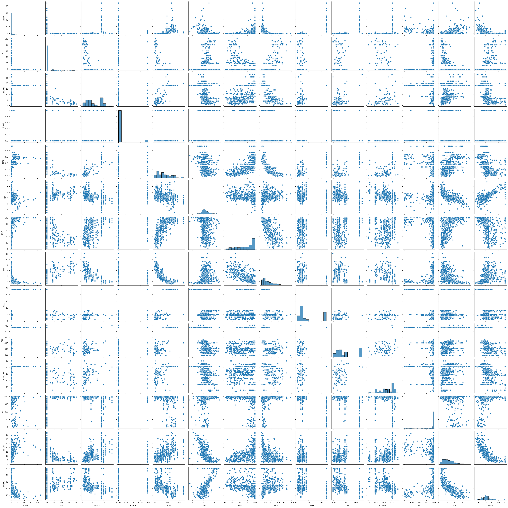
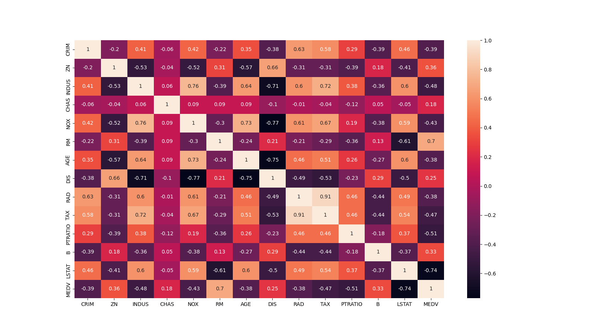
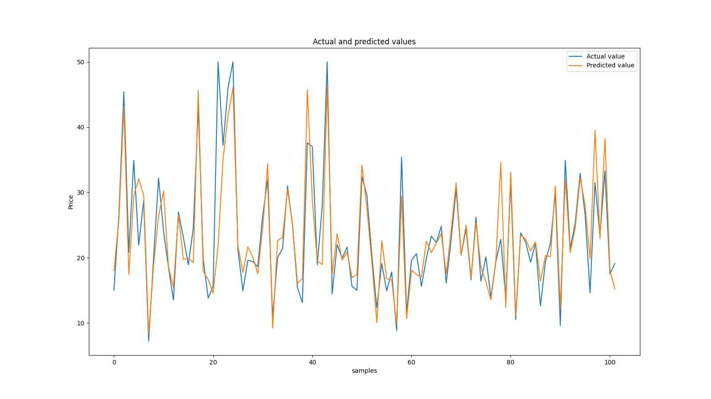
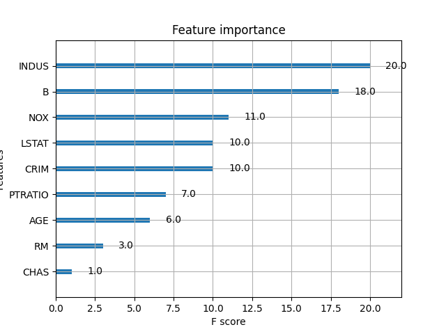
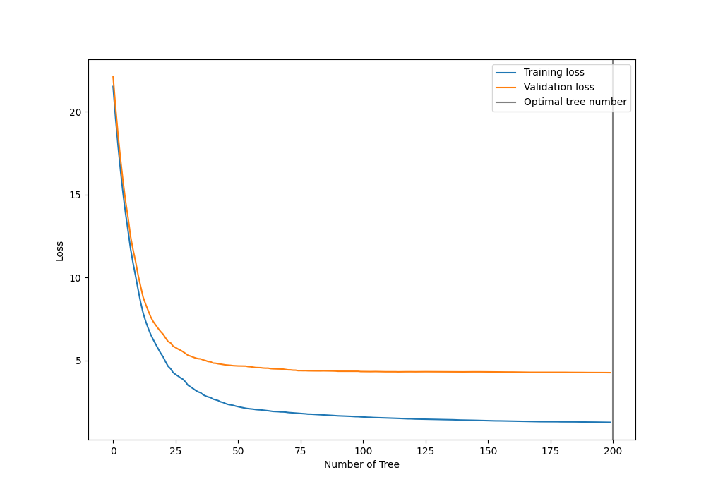

# Regression_analysis

## Outline

 
  - [Structure of the project](#structure-of-the-project)
    - [Getting the data](#getting-the-data)
    - [Exploratory Data Analysis (EDA)](#exploratory-data-analysis-eda)
    - [Training and Validation](#training-and-validation)
    - [Results](#results)
  - [Steps to run the project](#steps-to-run-the-project)
 


## Structure of the project 
In this task the goal is to do a regression analysis for the Boston housing dataset.
First step in any analysis is to understand the problem and familiarize ourselves with the 
dataset, these two points are addressed in [Getting the data](#getting-the-data) and the [EDA](#exploratory-data-analysis-eda).
After exploring the dataset, a model is trained and validated in [Training and Validation](#training-and-validation).
### Getting the data
To access the dataset you can load this dataset from `sklearn datasets`.

### Exploratory Data Analysis (EDA)
Let  us familiarize ourselves with the structure of teh dataset. Once you load the dataset, you will see that this dataset is saved in form of a dictionary and includes 4 keys as follows:
* data: contains the information for various houses.
* target:  prices of the house.
* feature_names: names of the features
* DESCR: describe the dataset

Therefore, as you can see there is already a key in this dictionary that decsribes the dataset and its features and 
gives us a quick introduction on the dataset. A function is implemented in the project that writes this information into a `txt` file and saves all the information related to boston housing proces into a file named
[`boston_housing_description.txt`](report_creator/boston_housing_decsription.txt)

**Data Set Characteristics:**  

    Number of Instances: 506 

    Number of Attributes: 13 numeric/categorical predictive. Median Value (attribute 14) is usually the target.

    Attribute Information (in order):
        - CRIM     per capita crime rate by town
        - ZN       proportion of residential land zoned for lots over 25,000 sq.ft.
        - INDUS    proportion of non-retail business acres per town
        - CHAS     Charles River dummy variable (= 1 if tract bounds river; 0 otherwise)
        - NOX      nitric oxides concentration (parts per 10 million)
        - RM       average number of rooms per dwelling
        - AGE      proportion of owner-occupied units built prior to 1940
        - DIS      weighted distances to five Boston employment centres
        - RAD      index of accessibility to radial highways
        - TAX      full-value property-tax rate per $10,000
        - PTRATIO  pupil-teacher ratio by town
        - B        1000(Bk - 0.63)^2 where Bk is the proportion of black people by town
        - LSTAT    % lower status of the population
        - MEDV     Median value of owner-occupied homes in $1000's

    Missing Attribute Values: None

    Creator: Harrison, D. and Rubinfeld, D.L.

This is a copy of UCI ML housing dataset.
https://archive.ics.uci.edu/ml/machine-learning-databases/housing/


This dataset was taken from the StatLib library which is maintained at Carnegie Mellon University.

The Boston house-price data of Harrison, D. and Rubinfeld, D.L. 'Hedonic
prices and the demand for clean air', J. Environ. Economics & Management,
vol.5, 81-102, 1978.   Used in Belsley, Kuh & Welsch, 'Regression diagnostics
...', Wiley, 1980.   N.B. Various transformations are used in the table on
pages 244-261 of the latter.

The Boston house-price data has been used in many machine learning papers that address regression
problems.   
     
References

   - Belsley, Kuh & Welsch, 'Regression diagnostics: Identifying Influential Data and Sources of Collinearity', Wiley, 1980. 244-261.
   - Quinlan,R. (1993). Combining Instance-Based and Model-Based Learning. In Proceedings on the Tenth International Conference of Machine Learning, 236-243, University of Massachusetts, Amherst. Morgan Kaufmann.

Based on the above description, the prices of the house indicated by the variable `MEDV` is our target variable and the remaining are the feature variables based on which we will predict the value of a house.

To understand the data better, we can take look at the pair distribution of the features and the target (housing price):

Also, in order to see the pearson correlation between the features, we can take a look at the below heatmap:

By looking at the correlation matrix we can see that RM has a strong positive correlation with `MEDV` (0.7) where as `LSTAT` has a high negative correlation with `MEDV`(-0.74).
In terms of statistics, we have described the dataset in the project to find the `min`, `max`, 'mean` and etc., for all the features.
### Training and Validation
XGBoost (Extreme Gradient Boosting) is one of the state of the art machine learning algorithms o deal with structured data. It belongs to a family of boosting algorithms and uses the gradient boosting (GBM) framework at its core. It is an optimized distributed gradient boosting library. 
In this section, first an XGboost model is trained and its hyperparameters are optimized using cross-validation and the model is used to predict the housing prices. `RMSE (root-mean-squared-error)` is used as the metric to evaluate the prediction.
YOu can see the results in the next part.
### Results
The below graph shows actual value of the housing price vs the predicted value using the trained XGBoost model.

You can see the feature importance in predicting the housing prices below:

This shows that the proportaion of the non-retail business is very important to predict the housing prices in Boston.

One part of the hyperparameter tuning for the XGBoost model is to find the optimal number of trees. The below graph shows the number of trees vs the loss.

Also, you can find the cross-valiation report [here](report_creator/cross_validation_report.csv).
The next graph shows the regression tree used for this problem:


## Steps to run the project
The structure of the folders are as follows:
```
.
├── README.md
├── report_creator
│   ├── actual_vs_predicted.png
│   ├── boston_housing_decsription.txt
│   ├── correlation.png
│   ├── cross_validation_report.csv
│   ├── distribution.png
│   ├── importance_plot.png
│   ├── optimal_num_tree.png
│   └── xgboost_tree.png
├── requirements.txt
└── src
    ├── eda.py
    ├── main.py
    ├── plot.py
    └── train.py
```
To run this project please make sure that you are in the same root as the `README.md` file.
* This project is using python=3.8
* Please install the `requirements.txt` file using the command below:
  ```
  pip install -r requirements.txt
  ```
* You can run the main file and get all the results by:
  ```
  python -m src.main
  ```  


